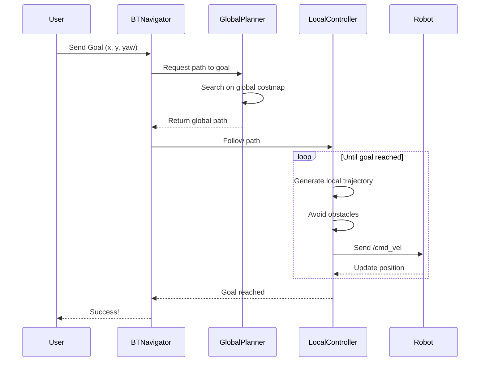

# Autonomous Navigation Guide - LidarBot ROS 2 Stack

> **Complete guide to autonomous navigation using ROS 2 Nav2 with mapless SLAM**
> 
> Version: 1.0 | Last Updated: 2026-02-16

---

## Table of Contents

1. [Overview](#overview)
2. [System Architecture](#system-architecture)
3. [Hardware Components](#hardware-components)
4. [Software Stack](#software-stack)
5. [Getting Started](#getting-started)
6. [Point A to Point B Navigation](#point-a-to-point-b-navigation)
7. [Parameter Tuning Guide](#parameter-tuning-guide)
8. [Debugging Strategies](#debugging-strategies)
9. [Common Issues and Solutions](#common-issues-and-solutions)
10. [Advanced Topics](#advanced-topics)

---

## Overview

This guide provides comprehensive documentation for the **LidarBot autonomous navigation system** built on ROS 2 Humble. The system uses **mapless SLAM** (Simultaneous Localization and Mapping) with **Nav2** (Navigation2) to enable a differential drive robot to autonomously navigate from point A to point B while avoiding obstacles.

### Key Features

- **Mapless Navigation**: Real-time SLAM using `slam_toolbox` in online async mapping mode
- **Real-time Obstacle Avoidance**: Dynamic costmap generation from YDLidar sensor data
- **Differential Drive**: ESP32-based hardware interface for motor control and odometry
- **IMU Integration**: MPU6050 for improved pose estimation
- **Dynamic Path Planning**: Nav2 stack with DWB local planner and NavFn global planner

### Technology Stack

| Component | Technology |
|-----------|-----------|
| **ROS Version** | ROS 2 Humble |
| **SLAM** | slam_toolbox (online async mapping) |
| **Navigation** | Nav2 (Navigation2) |
| **Hardware Interface** | ros2_control with custom serial hardware interface |
| **LiDAR** | YDLidar X2/X4 |
| **IMU** | MPU6050 |
| **Microcontroller** | ESP32 |
| **Motor Controller** | L298N H-Bridge |

---

## System Architecture

### High-Level Architecture Diagram

```mermaid
graph TB
    subgraph "Hardware Layer"
        ESP32[ESP32 Microcontroller]
        Motors[DC Motors]
        Encoders[Wheel Encoders]
        IMU[MPU6050 IMU]
        LiDAR[YDLidar]
    end

    subgraph "ROS 2 Control Layer"
        HWInterface[Serial Hardware Interface]
        ControllerManager[Controller Manager]
        DiffController[Diff Drive Controller]
        JointBroadcaster[Joint State Broadcaster]
        IMUBroadcaster[IMU Broadcaster]
    end

    subgraph "Perception Layer"
        LidarDriver[YDLidar Driver]
        ScanTopic[/scan topic]
    end

    subgraph "Localization & Mapping"
        SLAM[SLAM Toolbox]
        MapTopic[/map topic]
        TFMapOdom[map→odom TF]
    end

    subgraph "Navigation Layer"
        Nav2[Nav2 Stack]
        GlobalCostmap[Global Costmap]
        LocalCostmap[Local Costmap]
        Planner[Global Planner - NavFn]
        Controller[Local Controller - DWB]
        BTNavigator[Behavior Tree Navigator]
    end

    subgraph "User Interface"
        RViz[RViz2]
        GoalScript[send_navigation_goal.py]
    end

    ESP32 -->|Serial Data| HWInterface
    Motors -.->|Control| ESP32
    Encoders -->|Counts| ESP32
    IMU -->|Orientation| ESP32
    LiDAR -->|USB| LidarDriver

    HWInterface --> ControllerManager
    ControllerManager --> DiffController
    ControllerManager --> JointBroadcaster
    ControllerManager --> IMUBroadcaster

    DiffController -->|/diff_controller/odom| SLAM
    DiffController -->|/diff_controller/odom| Nav2
    LidarDriver --> ScanTopic
    ScanTopic --> SLAM
    ScanTopic --> GlobalCostmap
    ScanTopic --> LocalCostmap

    SLAM --> MapTopic
    SLAM --> TFMapOdom
    TFMapOdom --> Nav2

    MapTopic --> GlobalCostmap
    GlobalCostmap --> Planner
    LocalCostmap --> Controller
    Planner -->|Global Path| Controller
    Controller -->|/cmd_vel| DiffController
    BTNavigator --> Planner
    BTNavigator --> Controller

    GoalScript -->|Goal Pose| BTNavigator
    RViz -.->|Visualization| SLAM
    RViz -.->|Visualization| Nav2
```

### Data Flow

1. **Sensor Data Acquisition**
   - ESP32 reads encoder counts, IMU orientation
   - ESP32 sends data over serial: `D,left_enc,right_enc,yaw`
   - YDLidar publishes `/scan` data

2. **Odometry & State Estimation**
   - Hardware interface converts encoder ticks to wheel positions/velocities
   - Diff drive controller computes odometry (`/diff_controller/odom`)
   - Provides `odom → base_footprint` transform

3. **Mapping & Localization**
   - SLAM Toolbox consumes `/scan` and odometry
   - Builds occupancy grid map (`/map` topic)
   - Publishes `map → odom` transform
   - Completes TF chain: `map → odom → base_footprint → base_link`

4. **Path Planning**
   - **Global Planner (NavFn)**: Plans path from robot to goal on global costmap
   - **Local Planner (DWB)**: Generates velocity commands to follow path while avoiding obstacles

5. **Motion Control**
   - DWB outputs `/cmd_vel` (Twist messages)
   - Diff drive controller converts to wheel velocities
   - Hardware interface sends velocity commands to ESP32: `V,left_vel,right_vel`
   - ESP32 executes PID control to drive motors

### Frame Hierarchy

```
map (global reference)
 └─ odom (odometry reference, drift over time)
     └─ base_footprint (robot ground projection)
         └─ base_link (robot center)
             ├─ lidar_link (LiDAR sensor)
             ├─ imu_link (IMU sensor)
             ├─ left_wheel_link
             └─ right_wheel_link
```

---

## Hardware Components

### Robot Specifications

| Parameter | Value |
|-----------|-------|
| **Robot Type** | Differential Drive |
| **Wheel Separation** | 0.130 m (130 mm) |
| **Wheel Radius** | 0.0325 m (32.5 mm) |
| **Robot Radius** | 0.15 m (footprint) |
| **Max Linear Velocity** | 0.26 m/s |
| **Max Angular Velocity** | 1.0 rad/s |

### Hardware List

1. **ESP32 Development Board**
   - Serial communication at 115200 baud
   - Receives velocity commands from ROS 2
   - Sends encoder + IMU data to ROS 2
   - Runs PID control for motors

2. **Motor System**
   - DC geared motors (2x)
   - L298N motor driver
   - Quadrature encoders: 1300 ticks/revolution

3. **YDLidar X2/X4**
   - USB connection: `/dev/ttyUSB1`
   - Range: 0.12m to 10m
   - 360° scanning
   - Frequency: 7 Hz

4. **MPU6050 IMU**
   - 6-axis (gyro + accelerometer)
   - Provides yaw orientation
   - Connected to ESP32 via I2C

### Wiring Connections

```
ESP32 Pin Connections:
├─ GPIO TX/RX → USB-Serial adapter → /dev/ttyUSB0
├─ GPIO 4, 5 → Motor A (L298N IN1, IN2)
├─ GPIO 18, 19 → Motor B (L298N IN3, IN4)
├─ GPIO 21, 22 → I2C (SDA, SCL) → MPU6050
├─ GPIO 34, 35 → Encoder A (left wheel)
└─ GPIO 32, 33 → Encoder B (right wheel)

YDLidar:
└─ USB → /dev/ttyUSB1
```

---

## Software Stack

### ROS 2 Packages

The navigation stack consists of several key packages:

#### 1. **lidarbot_bringup**
Main launch package for bringing up the robot.

**Key Files:**
- [autonomous_navigation.launch.py](file:///home/shreeya/Documents/Github/autonomous_mobile_robotics/src/lidarbot/lidarbot_bringup/launch/autonomous_navigation.launch.py): Master launch file
- [lidarbot_check_hardware.launch.py](file:///home/shreeya/Documents/Github/autonomous_mobile_robotics/src/lidarbot/lidarbot_bringup/launch/lidarbot_check_hardware.launch.py): Hardware interface launcher
- [controllers.yaml](file:///home/shreeya/Documents/Github/autonomous_mobile_robotics/src/lidarbot/lidarbot_bringup/config/controllers.yaml): ros2_control configuration
- [ydlidar.yaml](file:///home/shreeya/Documents/Github/autonomous_mobile_robotics/src/lidarbot/lidarbot_bringup/config/ydlidar.yaml): LiDAR parameters

#### 2. **lidarbot_serial_base**
Custom hardware interface for ESP32 serial communication.

**Key Files:**
- [lidarbot_serial_hardware.cpp](file:///home/shreeya/Documents/Github/autonomous_mobile_robotics/src/lidarbot_serial_base/src/lidarbot_serial_hardware.cpp): Hardware interface implementation

**Data Protocol:**
- **From ESP32**: `D,<left_enc>,<right_enc>,<yaw_degrees>\n`
- **To ESP32**: `V,<left_vel_rad_s>,<right_vel_rad_s>\n`

#### 3. **lidarbot_slam**
SLAM configuration using slam_toolbox.

**Key Files:**
- [mapper_params_online_async.yaml](file:///home/shreeya/Documents/Github/autonomous_mobile_robotics/src/lidarbot/lidarbot_slam/config/mapper_params_online_async.yaml): SLAM parameters
- [online_async_launch.py](file:///home/shreeya/Documents/Github/autonomous_mobile_robotics/src/lidarbot/lidarbot_slam/launch/online_async_launch.py): SLAM launcher

#### 4. **lidarbot_navigation**
Nav2 configuration and navigation utilities.

**Key Files:**
- [nav2_params_mapless.yaml](file:///home/shreeya/Documents/Github/autonomous_mobile_robotics/src/lidarbot/lidarbot_navigation/config/nav2_params_mapless.yaml): Nav2 parameters
- [navigation_launch.py](file:///home/shreeya/Documents/Github/autonomous_mobile_robotics/src/lidarbot/lidarbot_navigation/launch/navigation_launch.py): Nav2 launcher
- [send_navigation_goal.py](file:///home/shreeya/Documents/Github/autonomous_mobile_robotics/src/lidarbot/lidarbot_navigation/scripts/send_navigation_goal.py): Goal sending script

#### 5. **lidarbot_description**
URDF robot description for TF tree and visualization.

### Node Architecture

When the navigation stack launches, the following nodes are started:

```
Navigation Stack Nodes:
├─ robot_state_publisher (TF broadcaster)
├─ controller_manager (ros2_control)
│   ├─ diff_controller (odometry + cmd_vel)
│   ├─ joint_state_broadcaster
│   └─ imu_broadcaster
├─ ydlidar_ros2_driver_node (LiDAR driver)
├─ slam_toolbox (SLAM)
└─ Nav2 Stack
    ├─ bt_navigator (behavior tree)
    ├─ controller_server (local planner)
    ├─ planner_server (global planner)
    ├─ behavior_server (recovery behaviors)
    ├─ waypoint_follower
    └─ velocity_smoother
```

### Topic Structure

**Published Topics:**
- `/scan` (sensor_msgs/LaserScan) - LiDAR data
- `/diff_controller/odom` (nav_msgs/Odometry) - Odometry from wheel encoders
- `/map` (nav_msgs/OccupancyGrid) - SLAM-generated map
- `/imu/data` (sensor_msgs/Imu) - IMU data
- `/joint_states` (sensor_msgs/JointState) - Wheel joint states
- `/local_costmap/costmap` - Local planning costmap
- `/global_costmap/costmap` - Global planning costmap
- `/plan` (nav_msgs/Path) - Global path

**Subscribed Topics:**
- `/cmd_vel` (geometry_msgs/Twist) - Velocity commands to robot
- `/goal_pose` (geometry_msgs/PoseStamped) - Navigation goal

---

## Getting Started

### Prerequisites

1. **Hardware Setup**
   - Robot assembled with all sensors connected
   - ESP32 flashed with appropriate firmware
   - Serial devices available:
     - `/dev/ttyUSB0` - ESP32
     - `/dev/ttyUSB1` - YDLidar

2. **Software Setup**
   - ROS 2 Humble installed
   - Workspace built: `~/Documents/Github/autonomous_mobile_robotics`
   - Dependencies installed:
     ```bash
     sudo apt install ros-humble-navigation2 ros-humble-nav2-bringup \
                      ros-humble-slam-toolbox ros-humble-robot-localization
     ```

3. **Permissions**
   ```bash
   sudo chmod 666 /dev/ttyUSB0  # ESP32
   sudo chmod 666 /dev/ttyUSB1  # YDLidar
   ```

### Build the Workspace

```bash
cd ~/Documents/Github/autonomous_mobile_robotics
colcon build --symlink-install
source install/setup.bash
```

### Launch Navigation Stack

#### Option 1: Complete Stack (Recommended)

This launches hardware interface, LiDAR, SLAM, and Nav2 all at once:

```bash
ros2 launch lidarbot_bringup autonomous_navigation.launch.py
```

**What happens:**
1. ✅ Serial hardware interface connects to ESP32
2. ✅ Controller manager loads diff_drive_controller
3. ✅ YDLidar driver starts publishing `/scan`
4. ✅ SLAM Toolbox begins mapping
5. ✅ Nav2 stack becomes active and ready for goals

#### Option 2: Step-by-Step (For Debugging)

**Terminal 1** - Hardware:
```bash
ros2 launch lidarbot_bringup lidarbot_check_hardware.launch.py use_ros2_control:=True
```

**Terminal 2** - SLAM:
```bash
ros2 launch lidarbot_slam online_async_launch.py
```

**Terminal 3** - Navigation:
```bash
ros2 launch lidarbot_navigation navigation_launch.py params_file:=config/nav2_params_mapless.yaml
```

### Verify System Status

**Check active nodes:**
```bash
ros2 node list
```

**Expected nodes:**
```
/bt_navigator
/controller_server
/planner_server
/behavior_server
/velocity_smoother
/waypoint_follower
/slam_toolbox
/controller_manager
/robot_state_publisher
/ydlidar_ros2_driver_node
```

**Check transforms:**
```bash
ros2 run tf2_tools view_frames
```

Should show complete chain: `map → odom → base_footprint → base_link`

**Verify topics:**
```bash
ros2 topic list
ros2 topic hz /scan           # Should be ~7 Hz
ros2 topic hz /diff_controller/odom  # Should be ~50 Hz
ros2 topic echo /map --once   # Check map is being published
```

---

## Point A to Point B Navigation

### Understanding the Navigation Process

When you send a navigation goal, here's what happens:



### Method 1: Using RViz2 (Visual Interface)

1. **Launch RViz2:**
   ```bash
   ros2 launch lidarbot_slam online_async_launch.py  # Includes RViz config
   ```
   
   Or manually:
   ```bash
   rviz2 -d src/lidarbot/lidarbot_slam/rviz/mapper_params_online_async.rviz
   ```

2. **Set Goal:**
   - Click "2D Goal Pose" button in RViz toolbar
   - Click on map where you want robot to go
   - Drag to set orientation
   - Release to send goal

3. **Monitor Progress:**
   - Green arrow shows current robot pose
   - Purple line shows global planned path
   - Local costmap (smaller grid) shows obstacle avoidance
   - Watch robot navigate to goal

### Method 2: Using Python Script (Programmatic)

The repository includes a convenient script for sending navigation goals:

```bash
ros2 run lidarbot_navigation send_navigation_goal.py <x> <y> [yaw_degrees]
```

**Examples:**

```bash
# Navigate to (2.0, 1.5) facing 90° (north)
ros2 run lidarbot_navigation send_navigation_goal.py 2.0 1.5 90

# Navigate to (-1.0, 0.5) facing 0° (east)
ros2 run lidarbot_navigation send_navigation_goal.py -1.0 0.5 0

# Navigate to (0.0, 0.0) facing 180° (west) - return to origin
ros2 run lidarbot_navigation send_navigation_goal.py 0.0 0.0 180
```

**Script Output:**
```
Waiting for Nav2 to become active...
Nav2 is active!

Sending goal: x=2.00, y=1.50, yaw=90.0°
Goal frame: map

Distance remaining: 3.25 m
Distance remaining: 2.10 m
Distance remaining: 0.85 m

✅ Goal succeeded!
```

### Method 3: Using ROS 2 CLI (Manual Topic)

For custom applications, publish directly to the goal topic:

```bash
ros2 topic pub --once /goal_pose geometry_msgs/PoseStamped "{
  header: {frame_id: 'map'},
  pose: {
    position: {x: 2.0, y: 1.5, z: 0.0},
    orientation: {x: 0.0, y: 0.0, z: 0.707, w: 0.707}
  }
}"
```

### Method 4: Using nav2_simple_commander (Python API)

For integration into custom Python code:

```python
#!/usr/bin/env python3
import rclpy
from nav2_simple_commander.robot_navigator import BasicNavigator
from geometry_msgs.msg import PoseStamped

rclpy.init()
navigator = BasicNavigator()

# Wait for Nav2
navigator.waitUntilNav2Active()

# Create goal
goal_pose = PoseStamped()
goal_pose.header.frame_id = 'map'
goal_pose.header.stamp = navigator.get_clock().now().to_msg()
goal_pose.pose.position.x = 2.0
goal_pose.pose.position.y = 1.5
goal_pose.pose.orientation.w = 1.0

# Send goal
navigator.goToPose(goal_pose)

# Wait for completion
while not navigator.isTaskComplete():
    feedback = navigator.getFeedback()
    print(f"Distance: {feedback.distance_remaining:.2f} m")

print("Navigation complete!")
navigator.lifecycleShutdown()
```

### Canceling Navigation

If the robot gets stuck or you need to stop:

**Using RViz:**
- Click the "Cancel Goal" button

**Using CLI:**
```bash
ros2 action send_goal /navigate_to_pose nav2_msgs/action/NavigateToPose --canceling
```

**Emergency Stop:**
```bash
# Publish zero velocity
ros2 topic pub /cmd_vel geometry_msgs/Twist "{linear: {x: 0.0}, angular: {z: 0.0}}"
```

---

## Parameter Tuning Guide

### Where to Tune: Configuration Files

All navigation parameters are in: [nav2_params_mapless.yaml](file:///home/shreeya/Documents/Github/autonomous_mobile_robotics/src/lidarbot/lidarbot_navigation/config/nav2_params_mapless.yaml)

After editing, restart the navigation stack for changes to take effect.

### 1. Controller Parameters (Local Planner - DWB)

**File location:** `controller_server.FollowPath` section

#### Velocity Limits

These determine how fast your robot can move:

```yaml
max_vel_x: 0.26        # Maximum forward velocity (m/s)
min_vel_x: 0.0         # Minimum forward velocity (can reverse if negative)
max_vel_theta: 1.0     # Maximum rotation speed (rad/s)
max_speed_xy: 0.26     # Overall speed limit
```

**Tuning tips:**
- ⚠️ **Too high**: Robot becomes unstable, overshoots goals
- ⚠️ **Too low**: Robot moves too slowly, navigation takes long time
- ✅ **Start conservative** (0.2 m/s), increase gradually while testing stability

#### Acceleration Limits

Control how quickly the robot can change speed:

```yaml
acc_lim_x: 2.5         # Linear acceleration (m/s²)
acc_lim_theta: 3.2     # Angular acceleration (rad/s²)
decel_lim_x: -2.5      # Linear deceleration (m/s²)
decel_lim_theta: -3.2  # Angular deceleration (rad/s²)
```

**Tuning tips:**
- ⚠️ **Too high**: Wheels slip, odometry becomes inaccurate
- ⚠️ **Too low**: Robot responds slowly to obstacles
- ✅ **Test on your surface**: Smooth floors allow higher values, carpet requires lower

#### Trajectory Sampling

These control how the planner evaluates possible paths:

```yaml
vx_samples: 20         # Number of linear velocity samples
vtheta_samples: 20     # Number of angular velocity samples
sim_time: 1.7          # How far ahead to simulate (seconds)
```

**Tuning tips:**
- ⚠️ **More samples**: Better paths but higher CPU usage
- ⚠️ **Longer sim_time**: Better lookahead but slower computation
- ✅ **Balance**: 15-25 samples, 1.5-2.5s sim_time for most robots

#### Trajectory Scoring (Critics)

The DWB planner scores trajectories using multiple critics:

```yaml
critics: ["RotateToGoal", "Oscillation", "BaseObstacle", "GoalAlign", "PathAlign", "PathDist", "GoalDist"]

BaseObstacle.scale: 0.02    # Obstacle avoidance weight
PathAlign.scale: 32.0       # Stay close to global path
GoalAlign.scale: 24.0       # Align heading with goal
PathDist.scale: 32.0        # Progress along path
GoalDist.scale: 24.0        # Distance to goal
RotateToGoal.scale: 32.0    # Rotate to face goal
```

**Tuning tips:**
- **Robot ignores obstacles**: Increase `BaseObstacle.scale`
- **Robot deviates from path**: Increase `PathAlign.scale`, `PathDist.scale`
- **Robot approaches goal at wrong angle**: Increase `GoalAlign.scale`, `RotateToGoal.scale`
- **Robot oscillates/wobbles**: Increase `Oscillation.scale`, reduce velocity

#### Goal Tolerance

How close is "close enough"?

```yaml
xy_goal_tolerance: 0.25     # Position tolerance (meters)
yaw_goal_tolerance: 0.25    # Orientation tolerance (radians ≈ 14°)
```

**Tuning tips:**
- ⚠️ **Too tight**: Robot struggles to reach goal, keeps adjusting
- ⚠️ **Too loose**: Inaccurate final positioning
- ✅ **Recommended**: 0.1-0.3m for position, 0.2-0.5 rad for orientation

### 2. Global Planner Parameters

**File location:** `planner_server.GridBased` section

```yaml
tolerance: 0.5          # Distance from goal planner will accept (m)
use_astar: false        # true = A*, false = Dijkstra
allow_unknown: true     # Can plan through unknown space?
```

**Tuning tips:**
- **Robot can't find path in sparse maps**: Set `allow_unknown: true`
- **Need optimal paths**: Set `use_astar: true` (slightly slower)
- **Planner fails often**: Increase `tolerance`

### 3. Costmap Parameters

#### Local Costmap

Rolling window around robot for reactive obstacle avoidance:

```yaml
local_costmap:
  width: 3              # Costmap width (meters)
  height: 3             # Costmap height (meters)
  resolution: 0.05      # Grid cell size (meters)
  update_frequency: 5.0 # Hz
  robot_radius: 0.15    # Robot footprint (meters)
```

**Tuning tips:**
- **Robot hits obstacles**: Increase `robot_radius`, reduce speed
- **Robot too cautious**: Decrease `inflation_radius`
- **Local planner slow**: Reduce `width`/`height`, increase `resolution`

#### Inflation Layer

Creates "cost gradient" around obstacles:

```yaml
inflation_layer:
  inflation_radius: 0.40      # How far to inflate obstacles (m)
  cost_scaling_factor: 3.0    # Exponential decay rate
```

**Tuning tips:**
- **Robot grazes obstacles**: Increase `inflation_radius`
- **Robot won't go through doorways**: Decrease `inflation_radius`
- **Cost transitions too sharp**: Increase `cost_scaling_factor`

#### Obstacle Layer

Configures how LiDAR data marks obstacles:

```yaml
scan:
  obstacle_max_range: 2.5    # Mark obstacles within this range (m)
  raytrace_max_range: 3.0    # Clear free space within this range (m)
```

**Tuning tips:**
- **Obstacles appear too close**: Reduce `obstacle_max_range`
- **Can't see far obstacles**: Increase `obstacle_max_range` (max = your LiDAR range)
- **Free space not cleared**: Increase `raytrace_max_range`

### 4. SLAM Parameters

**File location:** [mapper_params_online_async.yaml](file:///home/shreeya/Documents/Github/autonomous_mobile_robotics/src/lidarbot/lidarbot_slam/config/mapper_params_online_async.yaml)

#### Update Rates

```yaml
transform_publish_period: 0.02  # TF update rate (50 Hz)
map_update_interval: 5.0        # Publish /map every 5 seconds
throttle_scans: 1               # Use every Nth scan
```

**Tuning tips:**
- **Localization jumpy**: Decrease `transform_publish_period`
- **CPU too high**: Increase `throttle_scans`, `map_update_interval`

#### Scan Matching

```yaml
minimum_travel_distance: 0.5    # Min distance before adding new pose (m)
minimum_travel_heading: 0.5     # Min rotation before adding new pose (rad)
```

**Tuning tips:**
- **Map too dense**: Increase these values
- **Map too sparse, poor localization**: Decrease these values

#### Loop Closure

Detects when robot revisits a location:

```yaml
do_loop_closing: true                      # Enable loop closure
loop_search_maximum_distance: 3.0          # Search radius (m)
loop_match_minimum_response_fine: 0.45     # Match confidence threshold
```

**Tuning tips:**
- **Map drift over time**: Ensure `do_loop_closing: true`
- **False loop closures**: Increase `loop_match_minimum_response_fine`
- **Missing loop closures**: Decrease match thresholds, increase search distance

### 5. Controller Manager & Diff Drive

**File location:** [controllers.yaml](file:///home/shreeya/Documents/Github/autonomous_mobile_robotics/src/lidarbot/lidarbot_bringup/config/controllers.yaml)

#### Physical Parameters (CRITICAL - Must match your robot!)

```yaml
wheel_separation: 0.130    # Distance between wheels (m)
wheel_radius: 0.0325       # Radius of wheels (m)
```

**How to measure:**
1. **Wheel separation**: Measure distance between wheel contact points
2. **Wheel radius**: Measure wheel diameter, divide by 2

⚠️ **Inaccurate values cause**:
- Odometry drift
- Robot drives in circles when commanded straight
- Speed mismatch (robot faster/slower than commanded)

#### Odometry Publishing

```yaml
publish_rate: 50.0         # Odometry publish frequency (Hz)
enable_odom_tf: false      # We use SLAM for map→odom, not wheel odometry
```

### Tuning Workflow

**Step-by-step tuning process:**

1. **Start with Hardware**
   - ✅ Verify `wheel_separation` and `wheel_radius`
   - ✅ Test motors respond correctly to commands
   - ✅ Check encoder directions (forward = positive counts)

2. **Tune Velocity & Acceleration**
   - ✅ Set conservative `max_vel_x` and `max_vel_theta`
   - ✅ Test straight-line motion, increase until stable
   - ✅ Adjust `acc_lim` to prevent wheel slip

3. **Tune Costmaps**
   - ✅ Verify `robot_radius` matches physical robot
   - ✅ Adjust `inflation_radius` for obstacle clearance
   - ✅ Tune `obstacle_max_range` to LiDAR capabilities

4. **Tune Local Planner**
   - ✅ Adjust `sim_time` for appropriate lookahead
   - ✅ Tune critic scales to prioritize desired behavior
   - ✅ Relax goal tolerances if robot struggles to converge

5. **Tune SLAM**
   - ✅ Ensure loop closure works for long-term mapping
   - ✅ Adjust scan matching thresholds for environment
   - ✅ Balance update rates vs CPU usage

---

## Debugging Strategies

### Diagnostic Tools and Commands

#### 1. Check Node Status

```bash
# List all active nodes
ros2 node list

# Check if Nav2 nodes are running
ros2 node list | grep -E "bt_navigator|controller_server|planner_server"

# Get node info
ros2 node info /bt_navigator
```

#### 2. Monitor Topics

```bash
# Check topic publication rates
ros2 topic hz /scan
ros2 topic hz /diff_controller/odom
ros2 topic hz /cmd_vel

# Echo topic data
ros2 topic echo /scan --once
ros2 topic echo /diff_controller/odom
ros2 topic echo /map --once

# Show topic info
ros2 topic info /cmd_vel
```

#### 3. Inspect Transforms (TF)

```bash
# View TF tree
ros2 run tf2_tools view_frames
# Generates frames.pdf showing transform tree

# Echo specific transform
ros2 run tf2_ros tf2_echo map odom
ros2 run tf2_ros tf2_echo odom base_link

# Monitor TF publishing rate
ros2 topic hz /tf
```

#### 4. Check Parameters

```bash
# List parameters for a node
ros2 param list /controller_server

# Get specific parameter value
ros2 param get /controller_server FollowPath.max_vel_x

# Dump all parameters to file
ros2 param dump /controller_server > controller_params.yaml
```

#### 5. Action Server Status

```bash
# List active action servers
ros2 action list

# Check action server info
ros2 action info /navigate_to_pose

# Send test goal
ros2 action send_goal /navigate_to_pose nav2_msgs/action/NavigateToPose "{pose: {header: {frame_id: 'map'}, pose: {position: {x: 1.0, y: 0.5}}}}"
```

#### 6. Service Calls

```bash
# Clear costmaps (useful when robot gets stuck)
ros2 service call /local_costmap/clear_entirely_local_costmap nav2_msgs/srv/ClearEntireCostmap

# Get costmap
ros2 service call /global_costmap/get_costmap nav2_msgs/srv/GetCostmap
```

#### 7. ROS 2 Bag Recording

Record data for offline analysis:

```bash
# Record all topics
ros2 bag record -a

# Record specific topics
ros2 bag record /scan /diff_controller/odom /cmd_vel /map

# Playback recording
ros2 bag play <bag_file>
```

#### 8. Visualize with RViz2

```bash
rviz2 -d src/lidarbot/lidarbot_slam/rviz/mapper_params_online_async.rviz
```

**Key visualizations:**
- `/map` - SLAM-generated map
- `/scan` - LiDAR rays
- `/global_costmap/costmap` - Global planning layer
- `/local_costmap/costmap` - Local obstacle avoidance
- `/plan` - Global path (purple line)
- `/local_plan` - Local trajectory
- `TF` - Robot frames

#### 9. Logging and rqt Tools

```bash
# View logs in real-time
ros2 topic echo /rosout

# Launch rqt for graphical debugging
rqt

# Useful rqt plugins:
# - rqt_graph: Node/topic graph
# - rqt_tf_tree: TF tree visualization  
# - rqt_console: Log messages
# - rqt_topic: Topic monitor
# - rqt_plot: Real-time data plotting
```

### Debug Workflow by Symptom

#### Symptom 1: Robot Doesn't Move

**Checklist:**

1. ✅ **Check hardware interface is running:**
   ```bash
   ros2 topic echo /diff_controller/odom
   ```
   If no output → Hardware interface not connected

2. ✅ **Check serial connection:**
   ```bash
   ls /dev/ttyUSB*
   sudo chmod 666 /dev/ttyUSB0
   ```

3. ✅ **Verify ESP32 is receiving commands:**
   ```bash
   ros2 topic pub /cmd_vel geometry_msgs/Twist "{linear: {x: 0.1}, angular: {z: 0.0}}"
   ```
   Watch ESP32 serial monitor for incoming `V,` messages

4. ✅ **Check controller is loaded:**
   ```bash
   ros2 control list_controllers
   ```
   Should show `diff_controller [active]`

5. ✅ **Test teleop (bypasses navigation):**
   ```bash
   ros2 run teleop_twist_keyboard teleop_twist_keyboard
   ```

#### Symptom 2: Robot Spins in Circles

**Likely causes:**
- Incorrect `wheel_separation` or `wheel_radius`
- Swapped left/right motor wiring
- Encoder directions inverted

**Debug steps:**

1. ✅ **Verify odometry:**
   ```bash
   ros2 topic echo /diff_controller/odom
   ```
   Send forward command, check if odom shows straight motion

2. ✅ **Check encoder directions:**
   - Push robot forward manually
   - Run: `ros2 topic echo /joint_states`
   - Both encoders should increase

3. ✅ **Re-measure wheel parameters:**
   - Update [controllers.yaml](file:///home/shreeya/Documents/Github/autonomous_mobile_robotics/src/lidarbot/lidarbot_bringup/config/controllers.yaml)

#### Symptom 3: Navigation Fails "No Path Found"

**Checklist:**

1. ✅ **Check transforms:**
   ```bash
   ros2 run tf2_ros tf2_echo map base_link
   ```
   Should show valid transform, not errors

2. ✅ **Verify SLAM is running:**
   ```bash
   ros2 topic echo /map --once
   ```
   Map should have data

3. ✅ **Check if goal is in bounds:**
   - View map in RViz
   - Ensure goal is in explored (white/gray) area, not unknown (black)

4. ✅ **Increase planner tolerance:**
   ```yaml
   GridBased:
     tolerance: 1.0
     allow_unknown: true
   ```

5. ✅ **Clear costmaps:**
   ```bash
   ros2 service call /global_costmap/clear_entirely_global_costmap nav2_msgs/srv/ClearEntireCostmap
   ```

#### Symptom 4: Robot Gets Stuck Near Obstacles

**Likely causes:**
- Inflation radius too large
- Robot radius too conservative
- Local costmap too small

**Debug steps:**

1. ✅ **Visualize local costmap in RViz:**
   - Add display: `/local_costmap/costmap`
   - Check if obstacles are over-inflated (large red zones)

2. ✅ **Reduce inflation:**
   ```yaml
   inflation_layer:
     inflation_radius: 0.30  # Reduce from 0.40
   ```

3. ✅ **Increase local costmap size:**
   ```yaml
   local_costmap:
     width: 4  # Increase from 3
     height: 4
   ```

4. ✅ **Enable recovery behaviors:**
   Ensure behavior_server is running - robot will try backing up, rotating

#### Symptom 5: Poor Localization / Map Drift

**Checklist:**

1. ✅ **Check scan quality:**
   ```bash
   ros2 topic echo /scan
   ```
   Verify LiDAR is detecting obstacles

2. ✅ **Enable loop closure (if disabled):**
   ```yaml
   slam_toolbox:
     do_loop_closing: true
   ```

3. ✅ **Reduce scan matching thresholds:**
   ```yaml
   minimum_travel_distance: 0.3  # Reduce from 0.5
   ```

4. ✅ **Check for wheel slip:**
   - Odometry accuracy impacts SLAM
   - Test on different surface, reduce acceleration

5. ✅ **Verify IMU data:**
   ```bash
   ros2 topic echo /imu/data
   ```
   Check orientation quaternion is changing

#### Symptom 6: Robot Oscillates / Wobbles

**Likely causes:**
- Goal tolerances too tight
- Critic scales unbalanced
- Velocity limits too high

**Debug steps:**

1. ✅ **Relax goal tolerances:**
   ```yaml
   xy_goal_tolerance: 0.30     # Increase from 0.25
   yaw_goal_tolerance: 0.30
   ```

2. ✅ **Reduce max velocities:**
   ```yaml
   max_vel_x: 0.20             # Reduce from 0.26
   max_vel_theta: 0.8          # Reduce from 1.0
   ```

3. ✅ **Increase Oscillation critic:**
   ```yaml
   critics: [..., "Oscillation"]
   Oscillation.scale: 10.0
   ```

### Emergency Recovery Procedures

#### Full System Reset

```bash
# 1. Stop all ROS 2 nodes
killall -9 ros2

# 2. Clear serial connections
sudo chmod 666 /dev/ttyUSB*

# 3. Restart ESP32 (power cycle)

# 4. Re-launch navigation
ros2 launch lidarbot_bringup autonomous_navigation.launch.py
```

#### Clear All Costmaps

```bash
ros2 service call /local_costmap/clear_entirely_local_costmap nav2_msgs/srv/ClearEntireCostmap
ros2 service call /global_costmap/clear_entirely_global_costmap nav2_msgs/srv/ClearEntireCostmap
```

#### Manual Velocity Control (Override)

```bash
# Stop robot immediately
ros2 topic pub /cmd_vel geometry_msgs/Twist "{linear: {x: 0.0}, angular: {z: 0.0}}"

# Drive manually
ros2 run teleop_twist_keyboard teleop_twist_keyboard
```

---

## Common Issues and Solutions

### Issue 1: "Hardware interface failed to load"

**Error:**
```
[controller_manager]: Failed to load controller 'diff_controller'
```

**Solutions:**
1. Check serial port is accessible:
   ```bash
   ls -l /dev/ttyUSB0
   sudo chmod 666 /dev/ttyUSB0
   ```

2. Verify ESP32 is sending data:
   ```bash
   cat /dev/ttyUSB0
   ```
   Should see: `D,12345,12345,90.5`

3. Check URDF has correct ros2_control tags

4. Rebuild workspace:
   ```bash
   colcon build --packages-select lidarbot_serial_base
   source install/setup.bash
   ```

### Issue 2: "Transform timeout" errors

**Error:**
```
Timed out waiting for transform from base_link to map
```

**Solutions:**
1. Ensure SLAM is running:
   ```bash
   ros2 node list | grep slam
   ```

2. Check TF tree:
   ```bash
   ros2 run tf2_tools view_frames
   evince frames.pdf
   ```

3. Verify base_frame matches in all config files:
   - SLAM: `base_frame: base_link`
   - Nav2: `robot_base_frame: base_link`
   - Controller: `base_frame_id: base_footprint`

### Issue 3: "YDLidar connection failed"

**Error:**
```
[ydlidar_ros2_driver_node]: Failed to open lidar port
```

**Solutions:**
1. Check USB connection:
   ```bash
   ls /dev/ttyUSB*
   ```

2. Update port in config:
   ```yaml
   # File: ydlidar.yaml
   port: /dev/ttyUSB1  # or /dev/ttyUSB0
   ```

3. Check permissions:
   ```bash
   sudo chmod 666 /dev/ttyUSB1
   # Or add user to dialout group:
   sudo usermod -a -G dialout $USER
   ```

4. Verify baud rate matches LiDAR model:
   ```yaml
   baudrate: 115200  # X2 uses 115200, X4 might use 128000
   ```

### Issue 4: Robot moves slower/faster than expected

**Solutions:**
1. Verify wheel parameters in [controllers.yaml](file:///home/shreeya/Documents/Github/autonomous_mobile_robotics/src/lidarbot/lidarbot_bringup/config/controllers.yaml):
   ```yaml
   wheel_radius: 0.0325  # Measure your actual wheel!
   ```

2. Check encoder ticks per revolution:
   ```yaml
   enc_ticks_per_rev: 1300  # Verify with your encoders
   ```

3. Test odometry accuracy:
   - Command robot to move 1 meter
   - Measure actual distance traveled
   - Adjust `wheel_radius` proportionally

### Issue 5: Nav2 immediately fails goals

**Error:**
```
Goal was rejected or failed
```

**Solutions:**
1. Wait for Nav2 to activate:
   ```bash
   ros2 topic echo /bt_navigator/transition_event
   ```
   Should show `active` state

2. Check costmap is publishing:
   ```bash
   ros2 topic hz /global_costmap/costmap
   ```

3. Verify map frame exists:
   ```bash
   ros2 run tf2_ros tf2_echo map odom
   ```

4. Check Nav2 lifecycle:
   ```bash
   ros2 lifecycle get /bt_navigator
   ```
   Should be `active` (id=3)

### Issue 6: Map quality is poor

**Solutions:**
1. Improve scan quality:
   - Clean LiDAR lens
   - Check for loose connections
   - Increase `observation_sources` quality

2. Slow down robot during mapping:
   ```yaml
   max_vel_x: 0.15  # Slower = better SLAM
   ```

3. Add more features to environment:
   - Featureless walls → poor SLAM
   - Add objects, boxes for reference points

4. Tune SLAM parameters:
   ```yaml
   minimum_travel_distance: 0.3
   correlation_search_space_resolution: 0.01
   ```

---

## Advanced Topics

### Waypoint Following

Navigate through multiple waypoints sequentially:

```python
from nav2_simple_commander.robot_navigator import BasicNavigator

navigator = BasicNavigator()
navigator.waitUntilNav2Active()

# Define waypoints
waypoints = [
    create_pose(1.0, 0.0, 0.0),
    create_pose(2.0, 1.0, 90.0),
    create_pose(1.0, 2.0, 180.0),
    create_pose(0.0, 0.0, 270.0),
]

navigator.followWaypoints(waypoints)
while not navigator.isTaskComplete():
    feedback = navigator.getFeedback()
    print(f"Waypoint {feedback.current_waypoint}/{len(waypoints)}")
```

### Saving and Loading Maps

**Save current map:**
```bash
ros2 run nav2_map_server map_saver_cli -f ~/my_map
```

**Load saved map for localization:**
1. Switch SLAM to localization mode:
   ```yaml
   # mapper_params_online_async.yaml
   mode: localization
   map_file_name: /home/user/my_map
   ```

2. Use AMCL instead of SLAM for localization (more robust for known maps)

### Custom Recovery Behaviors

Add custom behaviors when robot gets stuck:

```yaml
behavior_server:
  behavior_plugins: ["spin", "backup", "drive_on_heading", "assisted_teleop", "wait", "custom_behavior"]
  custom_behavior:
    plugin: "my_package/CustomBehavior"
```

### Multi-Robot Coordination

For multiple robots, namespace everything:

```bash
ros2 launch lidarbot_bringup autonomous_navigation.launch.py namespace:=robot1
ros2 launch lidarbot_bringup autonomous_navigation.launch.py namespace:=robot2
```

### Performance Optimization

**Reduce CPU usage:**
- Increase costmap `resolution` (0.05 → 0.10)
- Reduce update frequencies
- Decrease `vx_samples`, `vtheta_samples`
- Use `throttle_scans: 2` in SLAM

**Improve real-time performance:**
- Use `SCHED_FIFO` for critical threads
- Disable unnecessary RViz displays
- Run navigation on dedicated core

---

## Quick Reference Card

### Essential Commands

| Task | Command |
|------|---------|
| **Build workspace** | `cd ~/Documents/Github/autonomous_mobile_robotics && colcon build --symlink-install` |
| **Source workspace** | `source install/setup.bash` |
| **Launch navigation** | `ros2 launch lidarbot_bringup autonomous_navigation.launch.py` |
| **Send goal** | `ros2 run lidarbot_navigation send_navigation_goal.py <x> <y> <yaw>` |
| **Open RViz** | `rviz2 -d src/lidarbot/lidarbot_slam/rviz/mapper_params_online_async.rviz` |
| **Stop robot** | `ros2 topic pub /cmd_vel geometry_msgs/Twist "{}"` |
| **Clear costmaps** | `ros2 service call /local_costmap/clear_entirely_local_costmap nav2_msgs/srv/ClearEntireCostmap` |
| **Check TF tree** | `ros2 run tf2_tools view_frames` |
| **List nodes** | `ros2 node list` |
| **Monitor topic** | `ros2 topic hz /scan` |

### Key Files

| File | Purpose |
|------|---------|
| [autonomous_navigation.launch.py](file:///home/shreeya/Documents/Github/autonomous_mobile_robotics/src/lidarbot/lidarbot_bringup/launch/autonomous_navigation.launch.py) | Main launch file |
| [nav2_params_mapless.yaml](file:///home/shreeya/Documents/Github/autonomous_mobile_robotics/src/lidarbot/lidarbot_navigation/config/nav2_params_mapless.yaml) | Navigation tuning |
| [mapper_params_online_async.yaml](file:///home/shreeya/Documents/Github/autonomous_mobile_robotics/src/lidarbot/lidarbot_slam/config/mapper_params_online_async.yaml) | SLAM configuration |
| [controllers.yaml](file:///home/shreeya/Documents/Github/autonomous_mobile_robotics/src/lidarbot/lidarbot_bringup/config/controllers.yaml) | Hardware parameters |
| [send_navigation_goal.py](file:///home/shreeya/Documents/Github/autonomous_mobile_robotics/src/lidarbot/lidarbot_navigation/scripts/send_navigation_goal.py) | Goal sending script |

### Configuration Files by Symptom

| Problem | File to Edit | Key Parameter |
|---------|--------------|---------------|
| Robot too fast/slow | [controllers.yaml](file:///home/shreeya/Documents/Github/autonomous_mobile_robotics/src/lidarbot/lidarbot_bringup/config/controllers.yaml) | `wheel_radius`, `wheel_separation` |
| Hits obstacles | [nav2_params_mapless.yaml](file:///home/shreeya/Documents/Github/autonomous_mobile_robotics/src/lidarbot/lidarbot_navigation/config/nav2_params_mapless.yaml) | `robot_radius`, `inflation_radius` |
| Can't reach goal | [nav2_params_mapless.yaml](file:///home/shreeya/Documents/Github/autonomous_mobile_robotics/src/lidarbot/lidarbot_navigation/config/nav2_params_mapless.yaml) | `xy_goal_tolerance`, `yaw_goal_tolerance` |
| Oscillates | [nav2_params_mapless.yaml](file:///home/shreeya/Documents/Github/autonomous_mobile_robotics/src/lidarbot/lidarbot_navigation/config/nav2_params_mapless.yaml) | `max_vel_x`, `max_vel_theta`, critic scales |
| Map drift | [mapper_params_online_async.yaml](file:///home/shreeya/Documents/Github/autonomous_mobile_robotics/src/lidarbot/lidarbot_slam/config/mapper_params_online_async.yaml) | `do_loop_closing`, `minimum_travel_distance` |
| No path found | [nav2_params_mapless.yaml](file:///home/shreeya/Documents/Github/autonomous_mobile_robotics/src/lidarbot/lidarbot_navigation/config/nav2_params_mapless.yaml) | `allow_unknown`, `tolerance` |

---

## Appendix

### Coordinate System Convention

- **X-axis**: Forward (robot front)
- **Y-axis**: Left (robot left side)
- **Z-axis**: Up (vertical)
- **Yaw**: Counter-clockwise rotation (0° = facing +X)

### ROS 2 Message Types

- `geometry_msgs/Twist` - Velocity commands (linear, angular)
- `geometry_msgs/PoseStamped` - Position + orientation with timestamp
- `nav_msgs/Odometry` - Robot pose and velocity estimate
- `sensor_msgs/LaserScan` - LiDAR data
- `nav_msgs/OccupancyGrid` - Map data
- `sensor_msgs/Imu` - IMU measurements

### Units Reference

| Quantity | Unit |
|----------|------|
| Distance | meters (m) |
| Velocity | meters/second (m/s) |
| Angle | radians (rad) |
| Angular velocity | radians/second (rad/s) |
| Time | seconds (s) |
| Frequency | Hertz (Hz) |

**Conversion:**
- 1 rad = 57.3°
- 90° = 1.57 rad
- 180° = 3.14 rad (π)

### Further Resources

- [ROS 2 Navigation Documentation](https://navigation.ros.org/)
- [slam_toolbox Documentation](https://github.com/SteveMacenski/slam_toolbox)
- [ros2_control Documentation](https://control.ros.org/)
- [Nav2 Tuning Guide](https://navigation.ros.org/tuning/index.html)

---

## Document Version History

| Version | Date | Changes |
|---------|------|---------|
| 1.0 | 2026-02-16 | Initial comprehensive guide created |

---

**For questions, issues, or contributions:**
- Repository: `/home/shreeya/Documents/Github/autonomous_mobile_robotics`
- Maintainer: Shreeya
